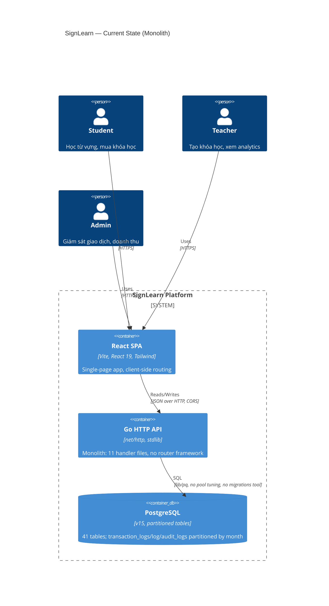
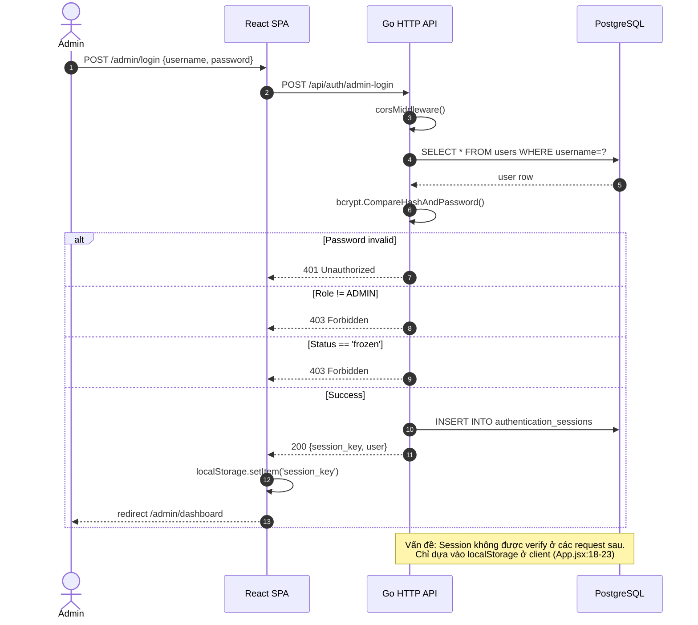
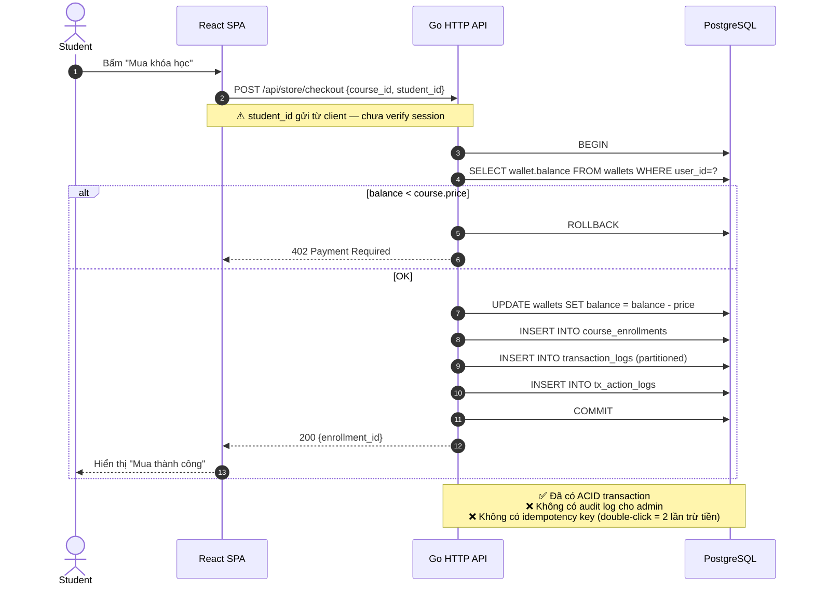

# Problem Framing & Architecture Drivers

**Hệ thống:** SignLearn E-Learning Platform  
**Phiên bản:** 2.0 (đề xuất)  
**Ngày:** 2026-06-17  
**Tác giả:** Software Architecture Team  
**Bối cảnh:** Hệ thống đã vận hành production với 18K+ users; cần tái cấu trúc luồng để chuẩn bị cho giai đoạn tăng trưởng.

---

## 1. Bối cảnh kinh doanh (Business Context)

SignLearn là nền tảng e-learning ngôn ngữ ký hiệu cho người Việt. Hệ thống phục vụ 3 nhóm người dùng:

| Vai trò | Mục tiêu chính | Quy mô dự kiến |
|---------|----------------|----------------|
| **Student** | Học từ vựng, làm quiz, mua khóa học | 18K+ MAU |
| **Teacher** | Tạo khóa học, xem phân tích hiệu năng | 50–200 giảng viên |
| **Admin** | Giám sát giao dịch, doanh thu, khóa user | 5–10 operators |

### 1.1 Vấn đề cốt lõi (Problem Statement)

> Hệ thống hiện tại được xây dựng theo mô hình **monolithic HTTP backend** (Go + `net/http`) với toàn bộ logic nghiệp vụ trộn lẫn trong 1 file `main.go`. Cấu trúc này phù hợp cho MVP nhưng **không thể mở rộng** khi:
>
> - Số lượng giao dịch tăng lên hàng triệu/tháng (cần tách transaction service).
> - Cần thêm real-time notifications (WebSocket) cho streak, quiz, leaderboard.
> - Cần audit log chuẩn SOC-2 cho compliance tài chính.
> - Frontend phải render nhanh hơn trên 3G (cần caching & CDN).

---

## 2. Drivers kiến trúc (Architecture Drivers)

Drivers được xếp hạng theo mức độ ảnh hưởng (Impact) và khó khăn (Difficulty).

| # | Driver | Loại | Impact | Difficulty | Ưu tiên |
|---|--------|------|--------|------------|---------|
| AD-01 | **Scalability** — hỗ trợ 100K MAU với p95 < 300ms | Quality | High | High | P0 |
| AD-02 | **Maintainability** — 11 handlers, 41 bảng DB, 0 test coverage | Quality | High | Medium | P0 |
| AD-03 | **Security** — RBAC, session expiry, audit trail, rate limiting | Quality | Critical | Medium | P0 |
| AD-04 | **Observability** — structured logs, metrics, tracing | Quality | Medium | Low | P1 |
| AD-05 | **Resilience** — không mất giao dịch tài chính khi DB hiccup | Quality | Critical | High | P0 |
| AD-06 | **Developer Experience** — local dev trong 1 lệnh, hot reload | Quality | Medium | Low | P1 |
| AD-07 | **Time-to-market** — phát hành tính năng mới trong < 1 sprint | Business | High | Medium | P1 |
| AD-08 | **Cost** — infra budget < $500/tháng ở 100K MAU | Constraint | Medium | Medium | P2 |

### 2.1 Ràng buộc (Constraints)

- **C-01:** Stack hiện tại là Go (backend) + React/Vite (frontend) + PostgreSQL. Không thay đổi ngôn ngữ.
- **C-02:** Hệ thống đang chạy production, mọi thay đổi phải **backward compatible**.
- **C-03:** Ngân sách infra tối đa $500/tháng.
- **C-04:** Phải tương thích với session-based auth hiện tại trong giai đoạn chuyển tiếp.

---

## 3. Mapping trạng thái hiện tại (Current-State Mapping)

### 3.1 Sơ đồ C4 — Container view (hiện tại)

### 3.2 Các vấn đề nóng (Hot Spots)

| Vấn đề | Vị trí | Hậu quả |
|--------|--------|---------|
| **P1: 41 endpoint, 1 router thủ công** | `main.go:68-99` | Dễ sai thứ tự đăng ký, không có middleware chaining |
| **P2: 0 test coverage** | Toàn bộ backend | Refactor rủi ro cao |
| **P3: CORS headers set trùng lặp** | Mỗi handler có block CORS riêng | Boilerplate ~15 dòng × 11 handlers |
| **P4: Path-based routing với string parsing** | `store_handler.go:20-35` `getUserIDFromPath` | Dễ vỡ khi refactor URL |
| **P5: Session lookup chưa có middleware** | Auth nằm trong từng handler nếu cần | Risk bypass auth |
| **P6: 41 tables nhưng không có migration tool** | DB schema trong init SQL | Khó reproduce local env |
| **P7: Tất cả roles (STUDENT/TEACHER/ADMIN) check inline** | `auth_handler.go:63` | RBAC không tái sử dụng được |
| **P8: Frontend App.jsx switch-case routing** | `App.jsx:18-72` | 16 routes if-else, không có lazy loading |

### 3.3 Sơ đồ tuần tự — Luồng đăng nhập admin hiện tại

### 3.4 Sơ đồ tuần tự — Luồng mua khóa học hiện tại (CHECKOUT)

---

## 4. Nguyên tắc kiến trúc đề xuất (Guiding Principles)

1. **Boring tech wins** — chỉ dùng công nghệ đã mature ≥ 3 năm (PostgreSQL, Redis, nginx, OpenTelemetry).
2. **Strangler Fig pattern** — từng phần tách ra, route traffic dần; không big-bang rewrite.
3. **Backend-for-Frontend (BFF) light** — chỉ làm BFF khi thật sự cần (sau 50K MAU).
4. **Schema-first** — mọi thay đổi DB phải có file migration số thứ tự, có `up`/`down`.
5. **Defense in depth** — auth ở 4 lớp: edge (nginx) → middleware → handler → repository.
6. **Observability from day 1** — mỗi request có request_id, log JSON, metric ở handler.

---

## 5. Tiêu chí thành công (Acceptance Criteria)

| Metric | Hiện tại | Mục tiêu (cuối 2026) |
|--------|----------|----------------------|
| p95 API latency | unknown | < 300ms |
| Uptime | unknown | 99.5% |
| Test coverage backend | 0% | ≥ 60% cho domain logic |
| Số bug P0 escape production/tháng | unknown | < 2 |
| Time onboard dev mới | ~2 tuần | < 3 ngày |
| Time deploy tính năng mới | ~1 ngày thủ công | < 30 phút CI/CD |

---

## 6. Phạm vi (Scope) & Ngoài phạm vi (Out of Scope)

### Trong phạm vi
- Tái cấu trúc backend Go thành layered architecture (router → middleware → handler → service → repository).
- Thêm middleware chuẩn: auth, RBAC, request_id, rate limit, recovery, CORS.
- Thêm tool migration DB (golang-migrate hoặc goose).
- Tái cấu trúc frontend routing bằng React Router với lazy loading.
- Bổ sung health check endpoint `/healthz`, `/readyz`.
- Bổ sung structured logging (slog) + request_id propagation.

### Ngoài phạm vi (giai đoạn này)
- Microservices decomposition (sẽ làm ở giai đoạn 3 nếu đạt 100K MAU).
- GraphQL gateway.
- WebSocket real-time (sẽ dùng SSE trước).
- Multi-region deployment.
- Machine learning personalization.

---

**Tài liệu tiếp theo:** [02-target-architecture.md](./02-target-architecture.md)
