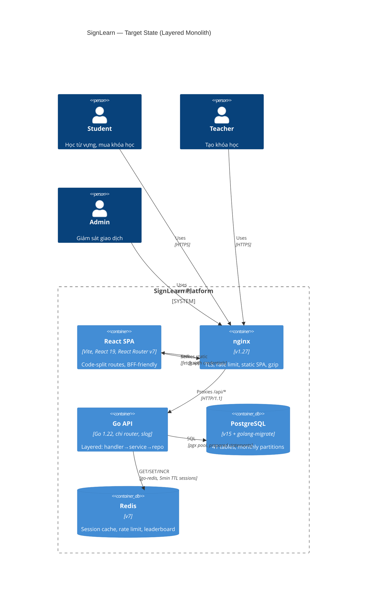
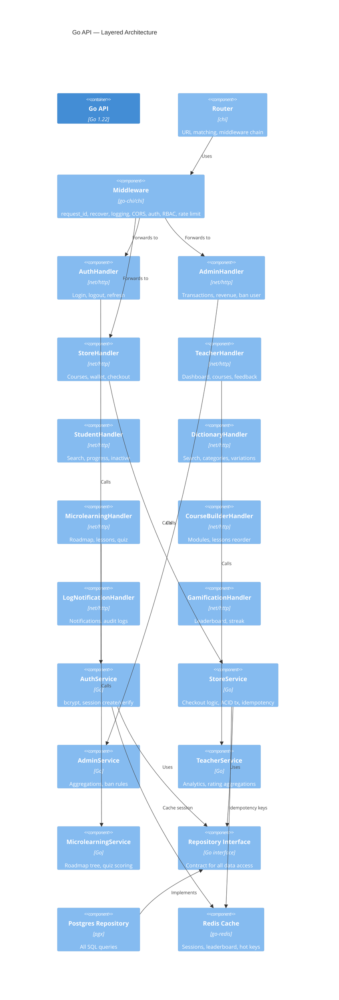
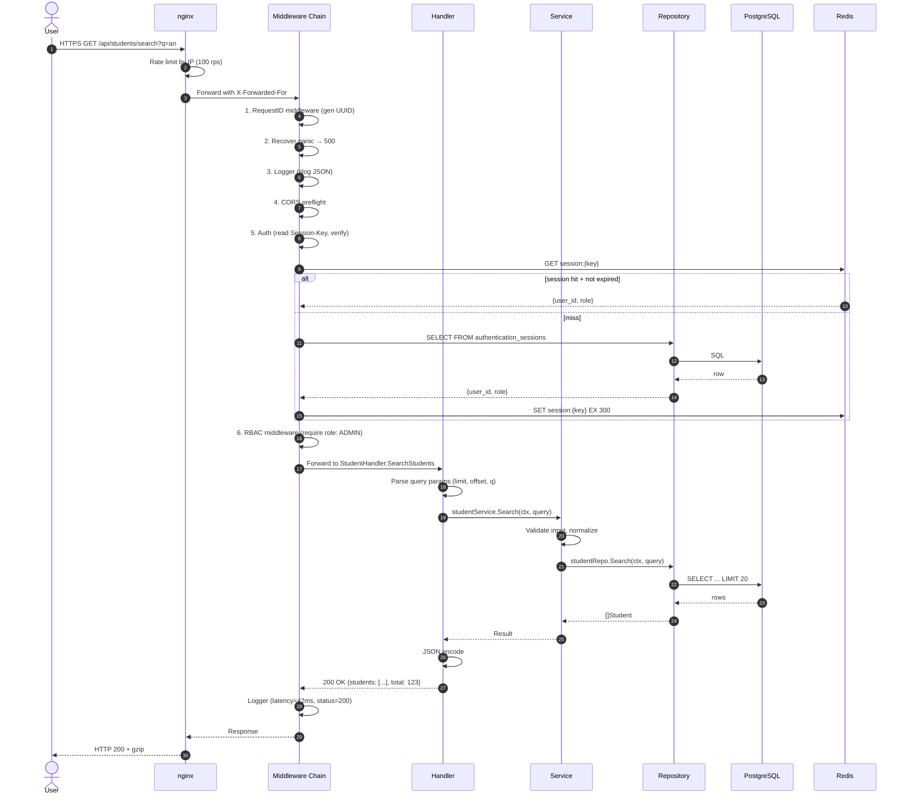
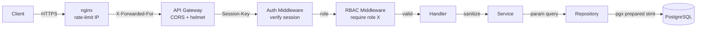

# Target Architecture — SignLearn v2.0

**Ngày:** 2026-06-17  
**Phạm vi:** Backend Go (refactor) + Frontend React (routing) + DevOps (CI/CD, observability)

---

## 1. Tầm nhìn tổng thể (Vision)

Chuyển từ **monolith "mỏng"** (chỉ có 1 file router, không có middleware) sang **layered monolith có cấu trúc rõ ràng**, sẵn sàng tách thành modular monolith / microservices khi cần (Strangler Fig pattern). Hệ thống phải:

- ✅ Có middleware chain chuẩn (auth, RBAC, rate limit, request_id, recovery)
- ✅ Có domain layer riêng (không trộn SQL vào handler)
- ✅ Có health check, metrics, structured logging
- ✅ Frontend có routing chuẩn, lazy loading, code splitting
- ✅ DB schema có migration tool

---

## 2. Sơ đồ C4 — Container view (Target)



### 2.1 Lợi ích so với hiện tại

| Khía cạnh | Hiện tại | Target |
|-----------|----------|--------|
| Router | `http.NewServeMux` (Go stdlib) + string match | `chi` router với middleware chain |
| Middleware | Chỉ có CORS | request_id → recovery → logging → CORS → auth → RBAC → rate limit |
| DB driver | `lib/pq` (cũ) | `pgx/v5` (nhanh hơn 2-3x, native prepared stmt) |
| Session | Chỉ lưu DB, không verify | DB + Redis cache, verify mỗi request |
| Logging | `log.Println` text | `slog` JSON với request_id, user_id, latency |
| Frontend routing | 16 if-else trong `App.jsx` | React Router v7, lazy load theo role |
| Migrations | SQL init script tĩnh | `golang-migrate` với file `up/down` đánh số |
| Caching | Không có | Redis cho leaderboard, course detail, dictionary |
| Health | Không có | `/healthz` (liveness), `/readyz` (readiness) |

---

## 3. Sơ đồ C4 — Component view (Backend layered)



### 3.1 Lợi ích của layered approach

1. **Handler chỉ làm 3 việc:** parse input, gọi service, format output. Không có SQL.
2. **Service chứa business logic:** validation, authorization, orchestration. Pure Go, dễ test.
3. **Repository là interface** + implementation Postgres. Sau này muốn cache hay dùng mock cho test đều dễ.
4. **Middleware chain** xử lý cross-cutting concerns (auth, logging, rate limit) 1 lần, dùng ở mọi handler.

---

## 4. Luồng xử lý request chuẩn (Request Lifecycle)



---

## 5. Tái cấu trúc Frontend Routing

### 5.1 Cấu trúc routing mới

```
/                              → LandingPage (public, lazy)
/admin/login                   → AdminLoginPage (public, lazy)
/admin/dashboard               → AdminDashboardPage (admin, lazy)
/admin/audit-logs              → AdminAuditLogsPage (admin, lazy)
/teacher/dashboard             → TeacherDashboardPage (teacher, lazy)
/teacher/courses/:id/builder   → CourseBuilderPage (teacher, lazy)
/student/dashboard             → StudentDashboardPage (student, lazy)
/students/manage               → StudentManagementPage (admin, lazy)
/store                         → CourseStorePage (student, lazy)
/leaderboard                   → LeaderboardPage (public, lazy)
/dictionary                    → DictionaryPage (public, lazy)
/dictionary?word=:word         → DictionaryPage (with search param)
/microlearning/roadmap         → MicrolearningRoadmapPage (student, lazy)
/microlearning/lessons/:id/quiz → LessonQuizPage (student, lazy)
```

### 5.2 Auth Provider + Protected Route

```jsx
<AuthProvider>
  <BrowserRouter>
    <Routes>
      <Route path="/" element={<LandingPage />} />
      <Route path="/admin/login" element={<AdminLoginPage />} />
      <Route element={<ProtectedRoute roles={['ADMIN']} />}>
        <Route path="/admin/dashboard" element={<AdminDashboardPage />} />
        <Route path="/admin/audit-logs" element={<AdminAuditLogsPage />} />
        <Route path="/students/manage" element={<StudentManagementPage />} />
      </Route>
      <Route element={<ProtectedRoute roles={['TEACHER', 'ADMIN']} />}>
        <Route path="/teacher/dashboard" element={<TeacherDashboardPage />} />
        <Route path="/teacher/courses/:id/builder" element={<CourseBuilderPage />} />
      </Route>
      <Route element={<ProtectedRoute roles={['STUDENT', 'ADMIN']} />}>
        <Route path="/student/dashboard" element={<StudentDashboardPage />} />
        <Route path="/store" element={<CourseStorePage />} />
        <Route path="/microlearning/roadmap" element={<MicrolearningRoadmapPage />} />
        <Route path="/microlearning/lessons/:id/quiz" element={<LessonQuizPage />} />
      </Route>
      <Route path="/leaderboard" element={<LeaderboardPage />} />
      <Route path="/dictionary" element={<DictionaryPage />} />
    </Routes>
  </BrowserRouter>
</AuthProvider>
```

### 5.3 Auth Context (centralized)

```jsx
// src/contexts/AuthContext.jsx
const AuthContext = createContext(null);

export function AuthProvider({ children }) {
  const [user, setUser] = useState(null);
  const [loading, setLoading] = useState(true);

  useEffect(() => {
    const sessionKey = localStorage.getItem('session_key');
    const adminUser = localStorage.getItem('admin_user');
    if (sessionKey && adminUser) {
      setUser(JSON.parse(adminUser));
    }
    setLoading(false);
  }, []);

  const login = (user, sessionKey) => {
    localStorage.setItem('session_key', sessionKey);
    localStorage.setItem('admin_user', JSON.stringify(user));
    localStorage.setItem('role_name', user.role_name);
    setUser(user);
  };

  const logout = () => {
    localStorage.removeItem('session_key');
    localStorage.removeItem('admin_user');
    localStorage.removeItem('role_name');
    setUser(null);
  };

  return (
    <AuthContext.Provider value={{ user, loading, login, logout }}>
      {children}
    </AuthContext.Provider>
  );
}

export const useAuth = () => useContext(AuthContext);
```

---

## 6. Thay đổi Database

### 6.1 Migration tool

Dùng [`golang-migrate`](https://github.com/golang-migrate/migrate) với cấu trúc:

```
backend/
  migrations/
    001_initial_schema.up.sql
    001_initial_schema.down.sql
    002_add_session_index.up.sql
    002_add_session_index.down.sql
    ...
```

### 6.2 Index mới cần thêm (P0)

```sql
-- migrations/003_add_critical_indexes.up.sql
CREATE INDEX CONCURRENTLY idx_users_username ON users (username) WHERE is_deleted = false;
CREATE INDEX CONCURRENTLY idx_sessions_key_expires ON authentication_sessions (session_key, expires_at);
CREATE INDEX CONCURRENTLY idx_transactions_created ON transaction_logs (created_at DESC);
CREATE INDEX CONCURRENTLY idx_enrollments_student_course ON course_enrollments (student_id, course_id);
CREATE INDEX CONCURRENTLY idx_student_streaks_student ON student_streaks (student_id);
```

### 6.3 Bảng mới: `idempotency_keys` (chống double-charge)

```sql
-- migrations/004_add_idempotency.up.sql
CREATE TABLE idempotency_keys (
  key TEXT PRIMARY KEY,
  user_id UUID NOT NULL,
  endpoint TEXT NOT NULL,
  response_status INT,
  response_body JSONB,
  created_at TIMESTAMPTZ NOT NULL DEFAULT now(),
  expires_at TIMESTAMPTZ NOT NULL
);
CREATE INDEX idx_idempotency_expires ON idempotency_keys (expires_at);
```

---

## 7. Observability

### 7.1 Structured logging (slog)

```go
// internal/middleware/logger.go
func Logger(next http.Handler) http.Handler {
  return http.HandlerFunc(func(w http.ResponseWriter, r *http.Request) {
    start := time.Now()
    reqID := middleware.GetReqID(r.Context())

    ww := middleware.NewWrapResponseWriter(w, r.ProtoMajor)
    next.ServeHTTP(ww, r)

    slog.Info("http_request",
      "request_id", reqID,
      "method", r.Method,
      "path", r.URL.Path,
      "status", ww.Status(),
      "latency_ms", time.Since(start).Milliseconds(),
      "user_id", auth.UserIDFromContext(r.Context()),
      "role", auth.RoleFromContext(r.Context()),
      "remote_ip", r.RemoteAddr,
    )
  })
}
```

### 7.2 Health checks

| Endpoint | Mục đích | Trả về |
|----------|----------|--------|
| `GET /healthz` | Liveness (process còn sống) | 200 "ok" |
| `GET /readyz` | Readiness (DB+Redis ready) | 200/503 |
| `GET /metrics` | Prometheus | text format |

---

## 8. Security Layers



| Layer | Công cụ | Bảo vệ |
|-------|---------|--------|
| Edge | nginx | TLS, IP rate limit, gzip, static |
| CORS | chi/cors | Origin whitelist |
| Auth | chi middleware | Session verify (DB+Redis) |
| RBAC | chi middleware | Role-based allow list |
| Input | validator/v10 | Schema validation |
| SQL | pgx prepared stmt | SQL injection |
| Output | Go html/template | XSS (nếu render HTML) |
| Audit | log table | SOC-2 trail |

---

## 9. Bảng so sánh Trade-offs

| Quyết định | Alternative | Lý do chọn | Trade-off |
|-----------|-------------|-----------|-----------|
| **chi router** | gorilla/mux, gin, stdlib | Nhẹ, idiomatic Go, middleware chuẩn net/http | Phải tự setup CSRF (nhưng SPA không cần) |
| **pgx/v5** | lib/pq (hiện tại), gorm | Nhanh hơn, prepared stmt, batch query | Không phải ORM → viết SQL thủ công |
| **Redis cache** | In-memory map, Memcached | Phổ biến, hỗ trợ TTL, có pub/sub | Thêm 1 service để quản lý |
| **React Router v7** | TanStack Router, Wouter | Chuẩn, lazy loading tốt, data router | Bundle lớn hơn Wouter ~20KB |
| **golang-migrate** | goose, sqlx, Atlas | CLI đơn giản, có Docker image | Không có GUI quản lý |
| **JWT (cho phase 3)** | Session (hiện tại) | Stateless, scale tốt | Phải có refresh token rotation |
| **Layered monolith** | Microservices ngay | Đơn giản, deploy 1 binary | Scale theo chiều dọc đến giới hạn |

---

## 10. Risk Register

| Risk | Xác suất | Tác động | Mitigation |
|------|----------|----------|------------|
| Refactor mất nhiều thời gian | High | High | Strangler Fig: giữ endpoint cũ, viết service mới bên cạnh, route dần |
| Frontend breaking change | Medium | High | Bật React Router mới ở `/v2/*` song song, fallback về `App.jsx` cũ |
| DB migration gây downtime | Medium | High | Dùng `CREATE INDEX CONCURRENTLY`, chạy ngoài giờ cao điểm |
| Thiếu test khi refactor | High | High | Bắt buộc test cho mỗi service mới, dùng table-driven tests |

---

**Tài liệu tiếp theo:** [03-adrs.md](./03-adrs.md) — các ADR cho quyết định kiến trúc
