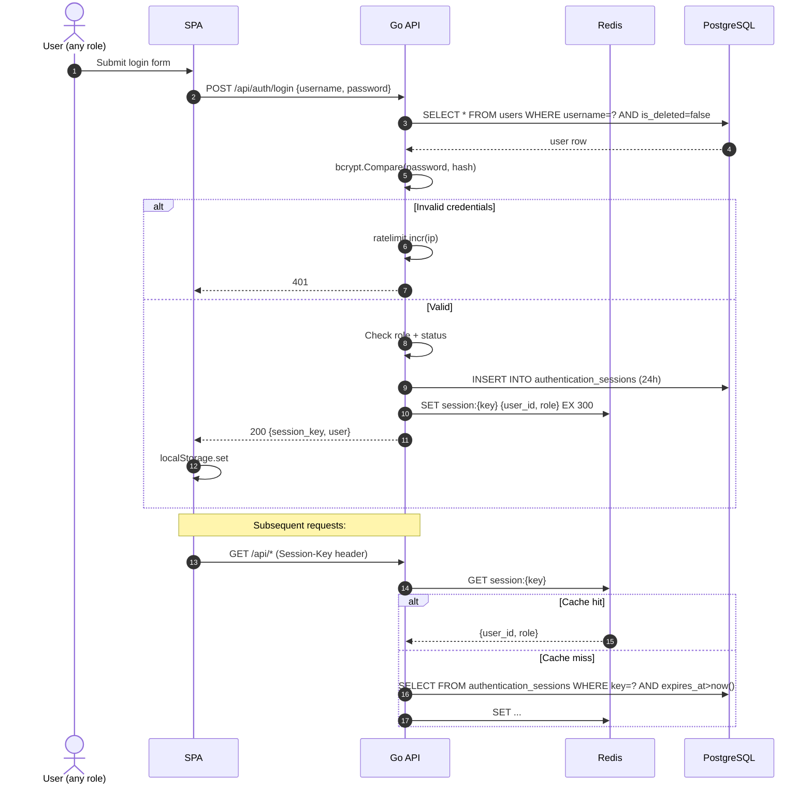
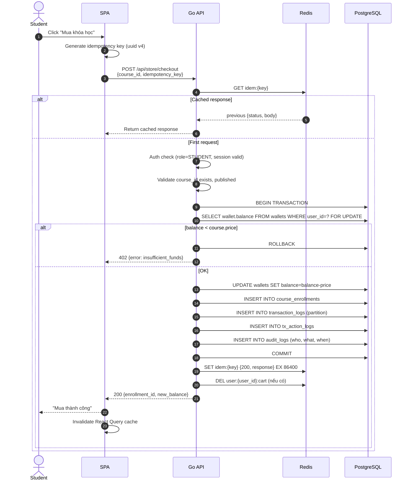
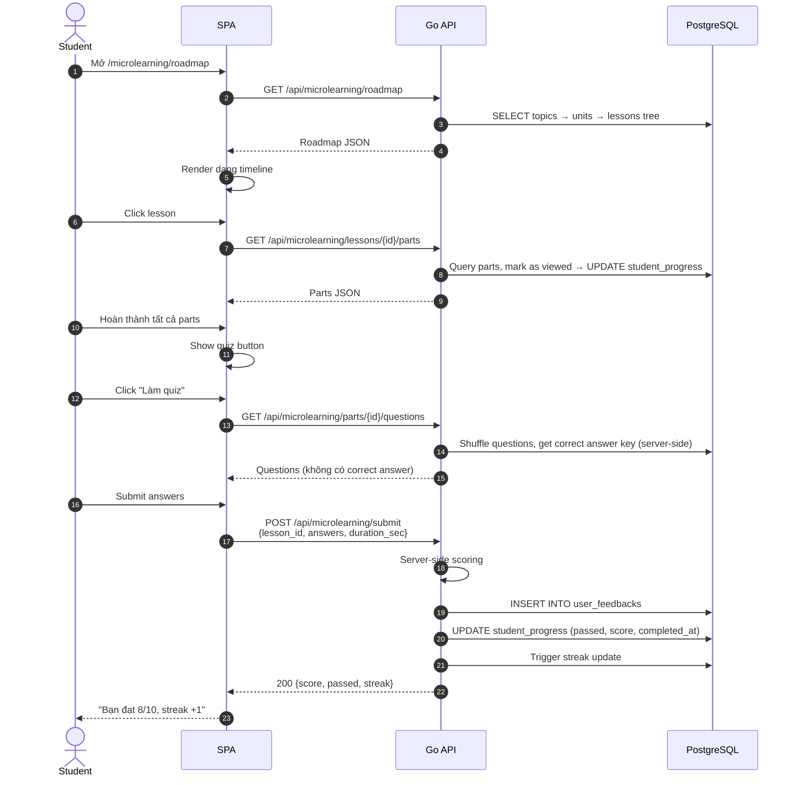
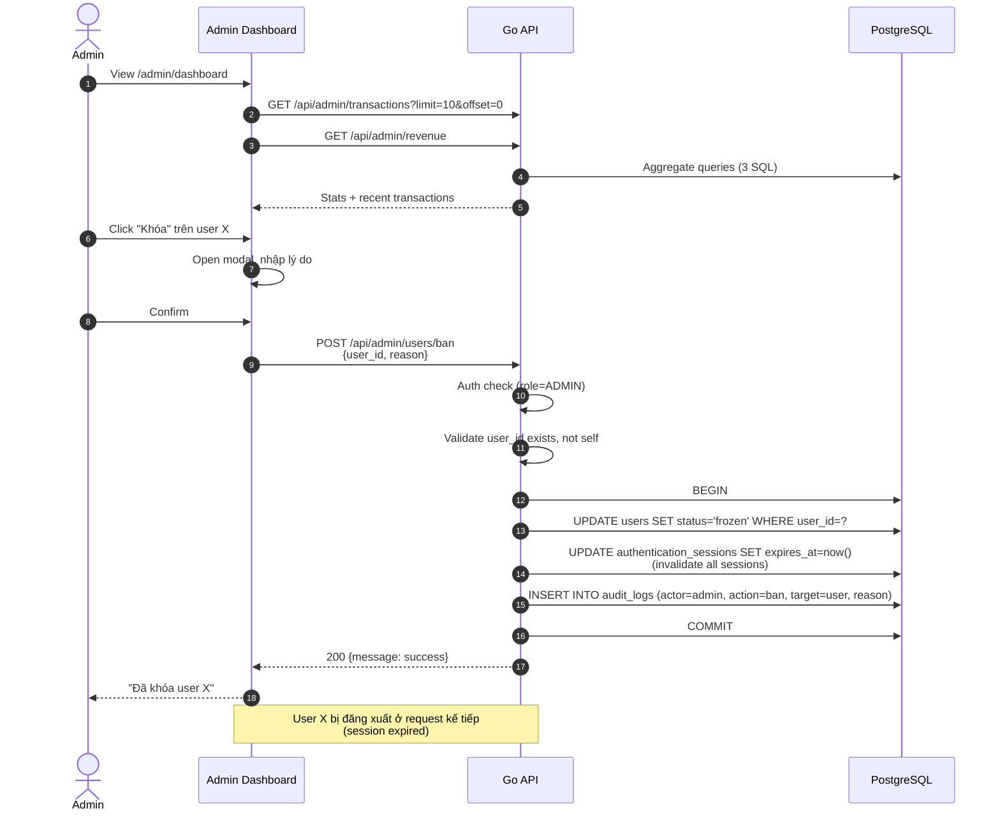
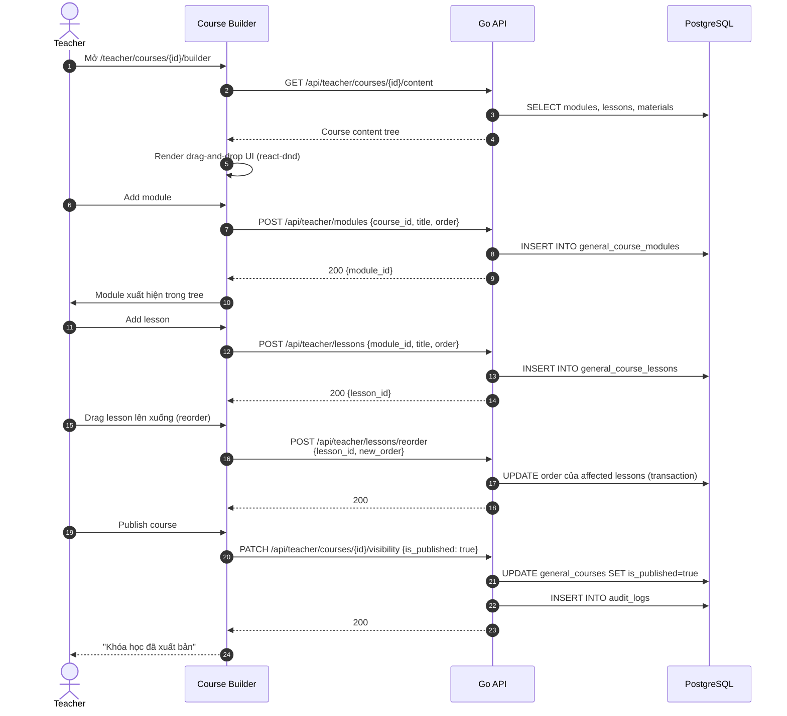
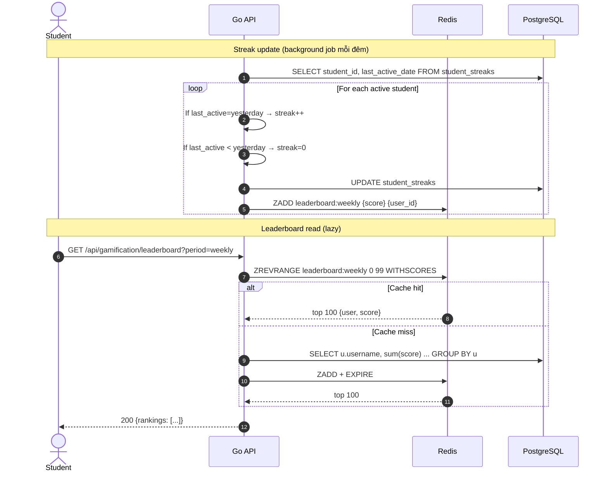
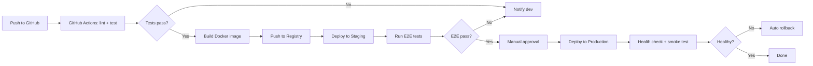

# System Flows & Migration Plan

**Ngày:** 2026-06-17  
**Mục tiêu:** Sơ đồ luồng nghiệp vụ chính + kế hoạch migration Strangler Fig

---

## 1. Luồng nghiệp vụ chính (Core Business Flows)

### 1.1 Đăng ký / Đăng nhập (Unified)



### 1.2 Mua khóa học (Checkout với Idempotency)



### 1.3 Học từ vựng + Quiz



### 1.4 Admin giám sát & khóa user



### 1.5 Giáo viên tạo khóa học



### 1.6 Gamification — Streak & Leaderboard



---

## 2. Migration Plan (Strangler Fig Pattern)

### 2.1 Nguyên tắc
- **Mỗi tuần**, thay thế **1 module nhỏ** của monolith cũ.
- **Song song** chạy cả code cũ + code mới 2 tuần, route 10% traffic sang code mới trước.
- **Rollback dễ** — chỉ cần tắt route mới.
- **Big-bang rewrite cấm**.

### 2.2 Roadmap 12 tuần

| Tuần | Công việc | Rollback plan |
|------|----------|---------------|
| **1** | Setup `chi` router + middleware chain. Tạo file `cmd/api/main.go` mới. | Code cũ vẫn chạy, file mới chưa được import. |
| **2** | Tách `auth_handler.go` + thêm middleware Auth (verify session). Unit test cho Auth. | Tắt middleware → fallback như cũ. |
| **3** | Tách `admin_handler.go` + RBAC middleware. Thêm `/healthz`, `/readyz`. | Fallback: gọi trực tiếp handler cũ. |
| **4** | Tách `store_handler.go` (CheckoutService riêng). Thêm idempotency table. | Feature flag `USE_NEW_CHECKOUT=0`. |
| **5** | Setup `golang-migrate`. Tạo 3 migration đầu (indexes, idempotency). | Dùng `migrate down` để revert. |
| **6** | Thêm Redis. Wire session cache + rate limit. | `REDIS_ENABLED=0` → fallback DB. |
| **7** | Tái cấu trúc `pgx/v5` cho repository. | Driver cũ vẫn dùng được song song 1 tuần. |
| **8** | Frontend: setup React Router v7 + AuthContext. Giữ `App.jsx` cũ backup. | ENV `USE_NEW_ROUTER=false`. |
| **9** | Frontend: migrate 4 trang (Landing, Login, StudentDash, AdminDash) sang React Router. | Từng trang dùng feature flag. |
| **10** | Migrate 4 trang tiếp (Teacher, Store, Dictionary, Micro). | Như tuần 9. |
| **11** | Thêm `/metrics` Prometheus + structured logging. | Tắt middleware. |
| **12** | Xóa code cũ, document hóa. | Git revert commit. |

### 2.3 Feature flag pattern

```go
// internal/feature/flag.go
package feature

import "os"

func IsEnabled(name string) bool {
  val := os.Getenv("FEATURE_" + name)
  return val == "1" || val == "true"
}

// Usage
if feature.IsEnabled("NEW_CHECKOUT") {
  return newCheckoutHandler.Checkout(w, r)
}
return legacyCheckoutHandler.Checkout(w, r)
```

### 2.4 Testing Strategy

| Layer | Test type | Tool | Coverage target |
|-------|----------|------|-----------------|
| Repository | Integration (real Postgres in Docker) | `dockertest` | 80% |
| Service | Unit (mock repository) | stdlib `testing` + `testify` | 90% |
| Handler | HTTP integration (real router) | `httptest` | 70% |
| Middleware | Unit | `httptest` | 100% |
| E2E | Playwright (UI) | `@playwright/test` | Critical paths |

### 2.5 CI/CD Pipeline (sau migration)



---

## 3. Database Migration Examples

### 3.1 File `001_initial_schema.up.sql` (extract từ init hiện tại)

```sql
-- 001_initial_schema.up.sql
-- Bảng users
CREATE TABLE IF NOT EXISTS users (
  user_id UUID PRIMARY KEY DEFAULT gen_random_uuid(),
  username VARCHAR(50) UNIQUE NOT NULL,
  password_hash VARCHAR(255) NOT NULL,
  email VARCHAR(255) UNIQUE NOT NULL,
  role_id INT NOT NULL REFERENCES roles(role_id),
  status VARCHAR(20) NOT NULL DEFAULT 'active' CHECK (status IN ('active', 'frozen', 'suspended')),
  created_at TIMESTAMPTZ DEFAULT now(),
  updated_at TIMESTAMPTZ DEFAULT now(),
  is_deleted BOOLEAN DEFAULT false
);

-- Bảng sessions
CREATE TABLE IF NOT EXISTS authentication_sessions (
  session_id UUID PRIMARY KEY DEFAULT gen_random_uuid(),
  user_id UUID NOT NULL REFERENCES users(user_id) ON DELETE CASCADE,
  session_key VARCHAR(64) UNIQUE NOT NULL,
  expires_at TIMESTAMPTZ NOT NULL,
  created_at TIMESTAMPTZ DEFAULT now()
);
```

### 3.2 File `003_add_critical_indexes.up.sql`

```sql
-- 003_add_critical_indexes.up.sql
CREATE INDEX CONCURRENTLY IF NOT EXISTS idx_users_username_active
  ON users (username) WHERE is_deleted = false;

CREATE INDEX CONCURRENTLY IF NOT EXISTS idx_sessions_key_expires
  ON authentication_sessions (session_key, expires_at);

CREATE INDEX CONCURRENTLY IF NOT EXISTS idx_transactions_created
  ON transaction_logs (created_at DESC);

CREATE INDEX CONCURRENTLY IF NOT EXISTS idx_enrollments_student_course
  ON course_enrollments (student_id, course_id);
```

### 3.3 File `004_add_idempotency.up.sql`

```sql
-- 004_add_idempotency.up.sql
CREATE TABLE idempotency_keys (
  key TEXT PRIMARY KEY,
  user_id UUID NOT NULL REFERENCES users(user_id),
  endpoint TEXT NOT NULL,
  response_status INT,
  response_body JSONB,
  created_at TIMESTAMPTZ NOT NULL DEFAULT now(),
  expires_at TIMESTAMPTZ NOT NULL
);

CREATE INDEX idx_idempotency_expires ON idempotency_keys (expires_at);

-- Cleanup job (chạy mỗi giờ)
-- DELETE FROM idempotency_keys WHERE expires_at < now();
```

---

## 4. Luồng triển khai (Deployment Flow)

### 4.1 Môi trường hiện tại (Docker Compose)

```yaml
# docker-compose.yml
version: '3.9'
services:
  db:
    image: postgres:15
    environment:
      POSTGRES_DB: elearning_db
      POSTGRES_USER: postgres
      POSTGRES_PASSWORD: postgres
    volumes:
      - pgdata:/var/lib/postgresql/data
      - ./backend/migrations/seed.sql:/docker-entrypoint-initdb.d/seed.sql
    ports:
      - "5432:5432"

  redis:
    image: redis:7-alpine
    command: redis-server --maxmemory 128mb --maxmemory-policy allkeys-lru
    ports:
      - "6379:6379"

  api:
    build: ./backend
    depends_on: [db, redis]
    environment:
      DB_HOST: db
      DB_PORT: 5432
      DB_USER: postgres
      DB_PASSWORD: postgres
      DB_NAME: elearning_db
      REDIS_HOST: redis
      REDIS_PORT: 6379
      SESSION_TTL: 86400
      REDIS_ENABLED: "1"
      FEATURE_NEW_CHECKOUT: "0"  # toggle khi sẵn sàng
      LOG_LEVEL: info
      LOG_FORMAT: json
    command: ["./wait-for", "db:5432", "redis:6379", "--", "./migrate", "up", "&&", "./api"]
    ports:
      - "8080:8080"

  spa:
    build: ./frontend
    environment:
      VITE_API_URL: http://localhost:8080
    ports:
      - "5173:5173"

volumes:
  pgdata:
```

### 4.2 Health check scripts

```bash
# health-check.sh
#!/bin/bash
# Gọi sau khi deploy
sleep 10
curl -fsS http://localhost:8080/healthz || exit 1
curl -fsS http://localhost:8080/readyz || exit 1
echo "Health check passed"
```

---

## 5. Monitoring & Alerting

### 5.1 Metrics (Prometheus format ở `/metrics`)

| Metric | Type | Labels | Mục đích |
|--------|------|--------|---------|
| `http_requests_total` | counter | method, path, status | Traffic |
| `http_request_duration_seconds` | histogram | method, path | Latency (p95) |
| `http_requests_in_flight` | gauge | - | Concurrency |
| `db_pool_acquired_conns` | gauge | - | DB pool usage |
| `db_query_duration_seconds` | histogram | query_name | DB slow queries |
| `cache_hits_total` / `cache_misses_total` | counter | key_prefix | Cache efficiency |
| `auth_sessions_active` | gauge | - | Active sessions |
| `login_attempts_total` | counter | result | Brute force detection |

### 5.2 Alerts (qua Alertmanager)

```yaml
groups:
  - name: signlearn
    rules:
      - alert: HighP95Latency
        expr: histogram_quantile(0.95, http_request_duration_seconds) > 0.3
        for: 5m
        labels: { severity: warning }

      - alert: HighErrorRate
        expr: rate(http_requests_total{status=~"5.."}[5m]) > 0.05
        for: 2m
        labels: { severity: critical }

      - alert: DBConnectionsExhausted
        expr: db_pool_acquired_conns / db_pool_total_conns > 0.9
        for: 1m
        labels: { severity: critical }
```

---

## 6. Tổng kết

Tài liệu này cùng với 3 file trước (`01-problem-framing.md`, `02-target-architecture.md`, `03-adrs.md`) tạo thành bộ **architecture documentation đầy đủ** cho dự án SignLearn:

```
docs/architecture/
├── 00-README.md                  ← (file này có thể thêm)
├── 01-problem-framing.md         ← Drivers, constraints, current state
├── 02-target-architecture.md     ← C4 diagrams, layered design, security
├── 03-adrs.md                    ← 9 quyết định có lý do
└── 04-flows-migration.md         ← Luồng nghiệp vụ + 12-week migration plan (file này)
```

**Nguyên tắc review:** Mỗi PR thay đổi kiến trúc phải cập nhật ít nhất 1 trong 4 file trên. ADR mới phải tạo thêm file `05-NNN-title.md`.

---

**Liên hệ:** Kiến trúc sư phụ trách — team Lead Backend
